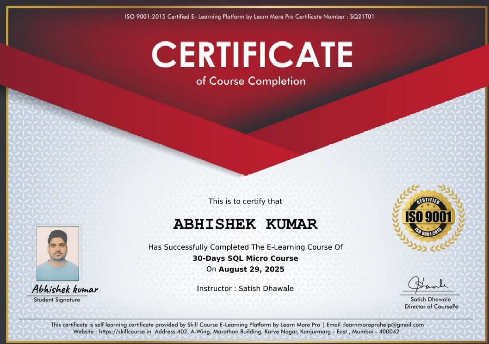

# 👋 Hello, I am Abhishek Kumar

I am an aspiring **Data Analyst** passionate about turning data into actionable insights.  
Here you can explore my **certificates, skills, and projects**.  

---

## 🏆 Certificates

### 1. Power BI Micro Course

**Issued By:** [Skill Course](https://www.skillcourse.in)  
**Date:** 19/12/2025  

### 2. 30-Days SQL Micro Course

**Issued By:** [Skill Course](https://www.skillcourse.in) 
**Date:** 29/08/2025  

> Hover over the certificates for a zoom effect. Click to view full size.

---

## 💻 Skills & Tools

---

---

## 📫 Connect with Me

---

> I am continuously learning and upskilling in **Data Analytics, SQL, Power BI, Excel, and Python**.  
> Let’s connect and explore opportunities in data-driven decision making! 🚀
